# 펭귄 데이터셋 분석 슬라이드

## 제목 슬라이드
펭귄 데이터셋(주요 신체지표) 탐색 분석
발표자: 자동 분석기

## 목차
1. 데이터 개요
2. 주요 시각화 및 인사이트 (여러 슬라이드)
3. 교차표/피봇 요약
4. 종합 해석 및 권고

## 데이터 개요
데이터셋은 세 종(Adelie, Chinstrap, Gentoo)과 세 섬(Biscoe, Dream, Torgersen), 성별, 부리/지느러미/체중 등의 수치형 변수를 포함한다. 결측값을 제거한 후 분석을 진행했으며, 전체 샘플 수는 333개이다. 요약 통계는 데이터의 중앙값·분산·범위를 제공하여 이후 시각화 해석의 기초가 된다.

## 히스토그램: 지느러미 길이
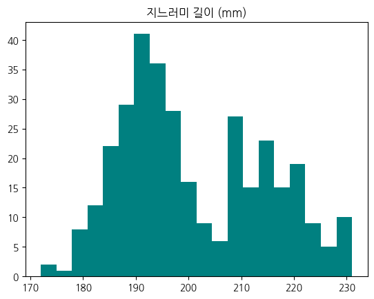

이번 히스토그램은 전체 샘플의 지느러미 길이 분포를 보여준다. 중앙값은 약 200mm 근처에 위치하며, 분포는 대체로 단봉형을 띠나 Gentoo 쪽으로 치우친 꼬리가 관찰된다. 종별 차이를 고려하면 지느러미 길이는 종 분류에 유의미한 설명력을 가지며, 분포의 극단값은 드물어 데이터 품질이 양호함을 시사한다.

## 히스토그램: 체중
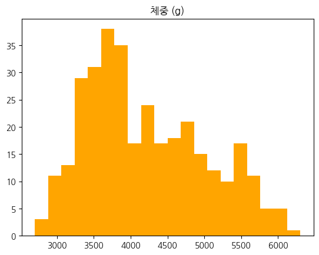

체중은 종별 차이가 뚜렷하게 나타나는 변수로, Gentoo가 높은 체중 구간에 밀집한다. 전체 분포는 약간의 우측 꼬리를 가지며 일부 고체중 개체가 존재한다. 따라서 종을 구분하지 않은 전체 통계는 그룹 간 차이를 가릴 수 있으므로, 분석 시 종 구분을 고려해야 한다.

## 산점도: 부리 길이 vs 부리 깊이
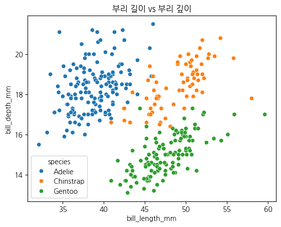

부리 길이와 부리 깊이의 산점도는 종별 군집 패턴을 보여준다. Gentoo는 부리 길이가 긴 쪽으로 뚜렷히 분리되는 반면, Adelie와 Chinstrap은 일부 중첩된다. 이 변수 조합은 분류 모델에서 유용할 수 있으나 일부 종 간에는 추가 변수가 필요하다.

## 변수들 간 관계 (Pairplot)
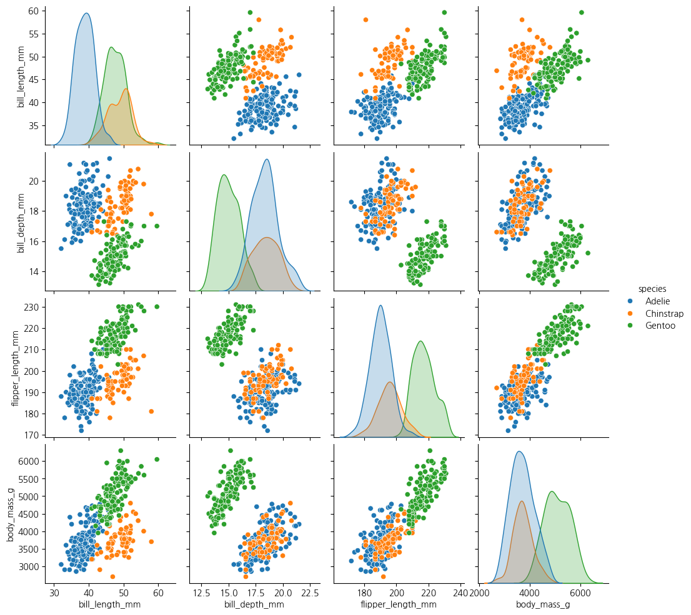

pairplot은 연속형 변수들 간의 쌍별 관계와 분포를 한눈에 보여준다. 지느러미 길이와 체중은 강한 양의 상관을 보이며 신체 크기를 대표하는 변수로 작용한다. 변수 선택과 전처리(정규화, 로그변환 등)에 관한 판단 근거로 활용할 수 있다.

## 상자그림: 종별 체중 분포
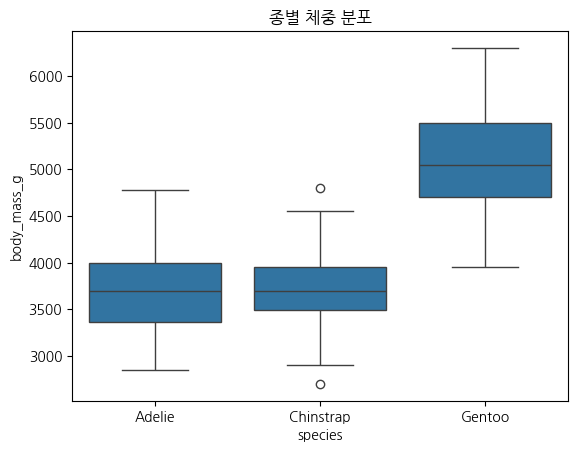

상자그림은 중앙값과 사분위 범위를 통해 종별 체중 분포를 비교한다. Gentoo는 중앙값과 분산이 모두 커 종 내 변동성이 크며, Adelie와 Chinstrap은 보다 안정적인 체중 분포를 보인다. 이상치 검토 및 생태학적 원인 분석이 필요하다.

## 바이올린플롯: 종별 지느러미 길이 분포
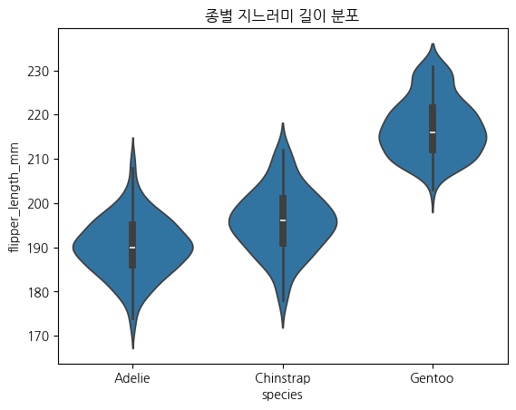

바이올린플롯은 밀도를 통해 각 종의 지느러미 길이 분포 특성을 보여준다. Gentoo는 우측으로 치우쳐 있고 밀집 구간이 넓어 평균적으로 긴 지느러미를 가지며, Adelie와 Chinstrap은 중앙에 모여 겹침이 존재한다. 이는 단일 변수로 완전 분류가 어렵다는 점을 시사한다.

## 막대(갯수): 종별 개체수
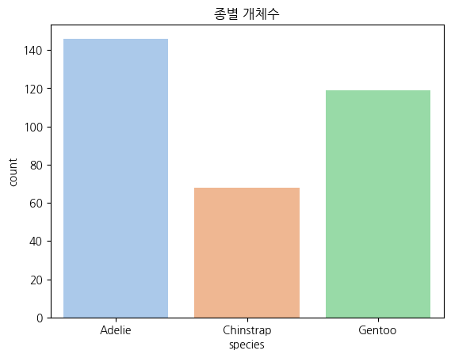

샘플링된 데이터에서 종별 개체수의 불균형은 모델링 시 주의가 필요하다. Gentoo와 Adelie가 비교적 많은 표본을 차지하며, 이로 인해 클래스 불균형 문제를 고려한 검증 전략이 필요하다.

## 막대: 종별 평균 체중
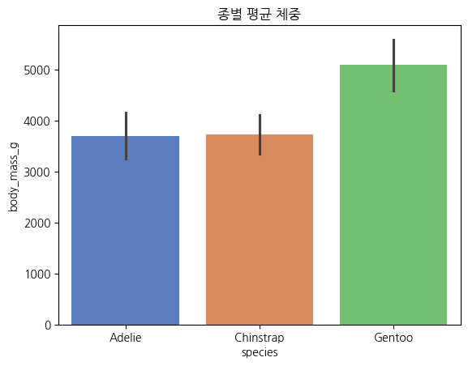

종별 평균 체중은 Gentoo가 가장 높으며, 오류막대(표준편차)는 종내 변동성을 나타낸다. 성별 구성 차이나 표본 크기를 함께 고려한 해석이 권장된다.

## 누적막대: 섬별 종 개수
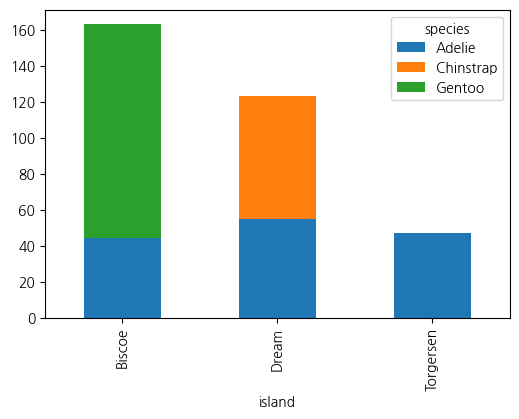

섬별 분포는 종의 서식 선호를 반영한다. Gentoo는 주로 Biscoe에, Chinstrap은 Dream에 집중되며, Adelie는 세 섬에 비교적 고르게 분포한다. 보전 및 현장 조사에 참고할 수 있는 공간적 지표이다.

## 히트맵: 상관계수 행렬
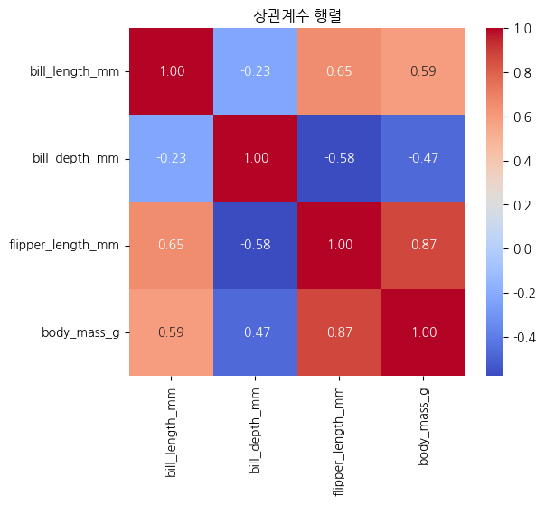

상관행렬은 지표들 간의 선형적 관계를 요약한다. 지느러미 길이와 체중의 강한 양의 상관은 다변량 모델에서 중요한 설명변수가 될 수 있음을 시사하며, 다중공선성 검토가 필요하다.

## 스웜플롯: 종별/성별 부리 길이
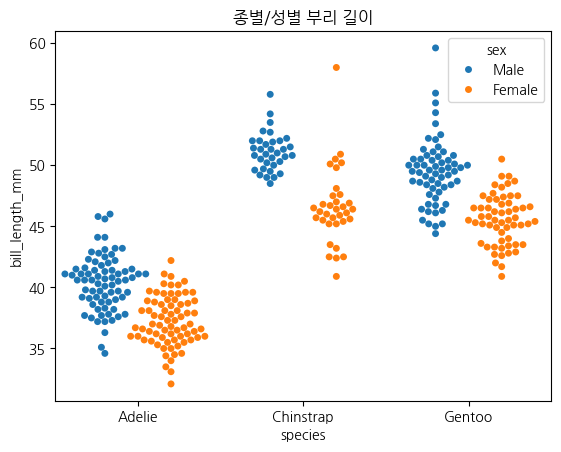

스웜플롯으로 개체 수준의 분포를 관찰하면 성별 차이와 개체간 이질성을 동시에 파악할 수 있다. 전반적으로 수컷이 암컷보다 약간 더 큰 경향을 보이며, 특히 Gentoo에서 그 차이가 명확하다.

## KDE: 종별 체중
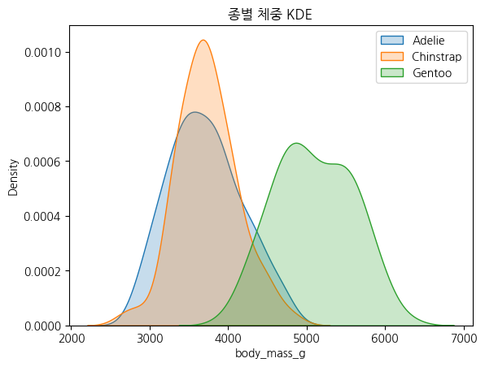

커널밀도추정은 종별 체중의 연속적 분포를 부드럽게 보여준다. Gentoo가 높은 체중 구간에 밀집하고, Adelie와 Chinstrap은 저체중대에서 부분적으로 겹친다. 밀도 차이는 분류 및 임계값 기반 해석에 유용하다.

## 종 vs 섬 교차표

| species   | Biscoe | Dream | Torgersen |
|:----------|-------:|------:|----------:|
| Adelie    | 44     | 55    | 47        |
| Chinstrap | 0      | 68    | 0         |
| Gentoo    | 119    | 0     | 0         |

이 표는 공간적 분포의 수치적 요약으로, 각 섬의 우선 보전대상 지정과 현장 모니터링 계획에 활용할 수 있다.

## 종 x 성별 평균 체중 (피봇)

| species   | Female  | Male    |
|:----------|--------:|--------:|
| Adelie    | 3368.84 | 4043.49 |
| Chinstrap | 3527.21 | 3938.97 |
| Gentoo    | 4679.74 | 5484.84 |

성별에 따른 체중 차이는 모든 종에서 관찰되며, 특히 Gentoo에서 차이가 큼. 성별을 통제한 분석이 권장된다.

## 종합 해석(1)
지느러미 길이와 체중은 신체 크기를 대표하는 주요 지표로 상호 연관성이 강하여 다변량 분석에서 핵심 변수로 사용할 수 있다. 부리 관련 변수들은 종마다 다르게 분포하여 특정 종 분류에 기여하지만, 일부 종 간에는 겹침이 있어 단일 변수로는 분류 한계가 있다. 샘플링 불균형과 섬별 분포 편향을 고려해 모델링과 결론을 도출해야 한다.

## 종합 해석(2) 및 권고
추가 분석으로는 성별·섬별·시기(연도)별 계층화 검정, 분류모형(랜덤포레스트, SVM 등) 적용 및 변수 중요도 분석을 권장한다. 보전 관점에서는 Gentoo와 Chinstrap의 섬별 집중 분포를 고려한 현장 모니터링 우선순위 설정과 표본 확장이 필요하다.

## 참고 및 다음 단계
1. 추가 변수 수집(나이, 번식 상태 등)
2. 시계열/공간 분석 적용
3. 모델 검증 및 배포

